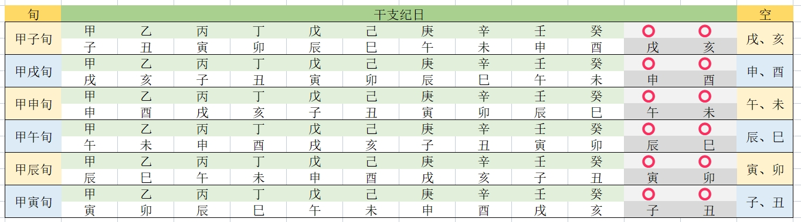

# 相关概念和话术

在易学，或者大六壬的学习和使用中，有很多平时没有接触过的，或者和我们日常使用有所区别的概念，
包括天干地支、阴阳五行等，还有围绕五行而衍生出来的五行之间的运动关系。

五行，描述的是物种状态。状态之间有相互作用，从而产生了旺相休囚、生化克制等。

大六壬是典型的地支学，每个地支符号也有自己的五行属性，所以地支间自然而然的也会产生各种作用结果。

## 零、五行

相生：金->水->木->火->土

相克：金->木->土->水->火

木：曲直。原指树木枝条生长，柔和，能屈能伸。引申为生长、升发、条达、舒畅等性质和作用的事物，都是木。

火：炎上。原指炙热、升腾。具有光明、温暖的特征，上升，从内到外。引申为热情、积极、能量释放。

土：土爰稼穑。稼是种植，穑是收割，原意指的是土承载万物并化育成果，具包容性与转化力。引申为稳定、调和与资源整合，体现为枢纽作用。

金：从革。原指顺从，变革。象征着顺从、肃杀、秩序、决断、变革等。

水：润下。原指滋润，下行。象征寒凉、隐匿、顺势，代表智慧，内敛，强调以柔克刚，蓄势待发。

## 一、天干地支

### 1、天干

天干，共有 10 个：

- 甲：阳，木。
- 乙：阴，木。
- 丙：阳，火。
- 丁：阴，火。
- 戊：阳，土。
- 己：阴，土。
- 庚：阳，金。
- 辛：阴，金。
- 壬：阳，水。
- 癸：阴，水。

部分学说认为，可能和十个手指的十进制有关，最早记日的时候，以十天为一旬，一旬就是一次天干的遍历。

### 2、地支

地支共有 12 个：

- 子：阳，水。
- 丑：阴，土。
- 寅：阳，木。
- 卯：阴，木。
- 辰：阳，土。
- 巳：阴，火。
- 午：阳，火。
- 未：阴，土。
- 申：阳，金。
- 酉：阴，金。
- 戌：阳，土。
- 亥：阴，水。

地支是通过观察岁星运动而发明的。后来又用于星宫划分，和每日的时辰划分。

地支，因为对应了十二个月份，又对应了四个季节，所以每个季节的 3 个地支，从前到后分别用`"孟、仲、季"`来排行：

- 四孟：寅、申、巳、亥
- 四仲：子、午、卯、酉
- 四季：辰、戌、丑、未

## 二、地支的生化克制

地支之间的关系，包括刑、冲、破、害、合。

冲，对立、冲突关系，引申为冲突、竞争、破坏。影响所有层面，例如身体、六亲、财物、事业。

刑，制约、克制关系。引申为冲突、矛盾、惩罚、用刑。影响性格、健康、六亲等。

害，相互伤害、不利。引申为矛盾和阻碍。背地里加害，影响人际关系。

破，相互破坏、削弱、不利。引申为导致事情不顺利，影响较小。

合，合作，结合，调合。代表和谐、稳定等积极影响。

然后具体再进行细分，主要包括：

- 三刑
- 六害
- 六冲
- 六破
- 六合
- 三合

### 1、六冲

冲比较严重，冲日干则伤自己，冲日支则环境会变动。吉神被冲就不吉利了，但是如果凶神被冲反而不凶了。

- 子午相冲：子为阳水，午为阳火，水火不容。
- 丑未相冲：丑为阴土，未为阴土，丑为湿土，未为燥土，湿燥相冲。
- 寅申相冲：寅为阳木，申为阴金，金克木。
- 卯酉相冲：卯为阴木，酉为阳金，金克木。
- 辰戌相冲：辰为阳土，戌为阴土，辰为水库，戌为火库，水火相冲。
- 巳亥相冲：巳为阴火，亥为阳水，水火相冲。

### 2、三刑

自刑、无礼、无恩、恃势。

- 自刑：辰午酉亥自刑。自己和自己刑。主自我招灾，自我伤残。
- 无礼：子卯互刑。子刑卯，卯刑子。主无礼而犯法，关系不协调，表现为无礼、无义、大荡、小淫。（荡，不守规矩；淫，过度，放纵）。
- 无恩：寅巳申。寅刑巳，巳刑申，申刑寅。相互制约、相互克制。表现为无情、无恩、没有道德。
- 恃势：丑戌未。丑刑戌，戌刑未，未刑丑。主威凌、势挟。表现为霸道、强势、倚强凌弱、仗势欺人。

### 3、六害

主事多阻断，必无和气。宜受不宜动。

- 子未相害：子为阳水，未为阴土，水土相战。
- 丑午相害：丑为阴土，午为阳火，火炎土湿，性质相悖。
- 寅巳相害：寅为阳木，巳为阴火，木生火而火炽，寅巳相害。
- 卯辰相害：卯为阴木，辰为阳土，木克土，卯辰相害。
- 申亥相害：申为阴金，亥为阳水，金生水，但申中藏有壬水，亥中藏有甲木，壬水克申中庚金，甲木克亥中壬水，相害而暗战。
- 酉戌相害：酉为阳金，戌为阴土，金克土，酉戌相害。

### 4、六破

事多中途更改，不完整。

- 子酉相破：子为阳水，酉为阳金，金生水，但酉金为静，子水为动，相破。
- 午卯相破：午为阳火，卯为阴木，木生火，但卯木为静，午火为动，相破。
- 申巳相破：申为阴金，巳为阴火，火克金，申巳相破。
- 寅亥相破：寅为阳木，亥为阳水，木生水，但寅木为动，亥水为静，相破。
- 丑辰相破：丑为阴土，辰为阳土，丑为湿土，辰为水库，土克水，相破。
- 未戌相破：未为阴土，戌为阴土，未为燥土，戌为火库，相破。

### 5、六合

万事如意。

- 子丑合土：子为阳水，丑为阴土，水寒土湿，合而化土。
- 寅亥合木：寅为阳木，亥为阳水，木得水而生，合而化木。
- 卯戌合火：卯为阴木，戌为阴土，木生火，合而化火。
- 辰酉合金：辰为阳土，酉为阳金，土生金，合而化金。
- 巳申合水：巳为阴火，申为阴金，火克金，但巳中藏有丙火，申中藏有庚金，丙火克庚金，相合而化水。
- 午未合土：午为阳火，未为阴土，火燥土焦，合而化土。

### 6、三合

- 申子辰合水局：申为阴金，子为阳水，辰为阳土，金生水，水生木，合而化水。
- 巳酉丑合金局：巳为阴火，酉为阳金，丑为阴土，火克金，金生水，合而化金。
- 寅午戌合火局：寅为阳木，午为阳火，戌为阴土，木生火，火生土，合而化火。
- 亥卯未合木局：亥为阳水，卯为阴木，未为阴土，水生木，木生火，合而化木。

## 三、地支的旺相休囚

旺相休囚死，是描述五行在不同季节的强弱，

旺：和当季的五行属性一样，当令，最强。

相：次强，被当令五行所生。处于辅助地位。

休：能量衰退。生当令的五行。

囚：困顿，衰弱，有犯上之心。为克当令的五行。

死：被当令五行克制，没有生气。

| 季节           | 旺  | 相  | 休  | 囚  | 死  |
| -------------- | --- | --- | --- | --- | --- |
| 春             | 木  | 火  | 水  | 金  | 土  |
| 夏             | 火  | 土  | 木  | 水  | 金  |
| 秋             | 金  | 水  | 土  | 火  | 木  |
| 冬             | 水  | 木  | 金  | 土  | 火  |
| 四季最后一个月 | 土  | 金  | 火  | 木  | 水  |

## 四、十二长生

十二长生，是用来描述命运的旺衰之势，就是五行的十二个状态。同时又来描述世间万物从生发到衰亡的过程。

概览如下，[详细说明](./十二长生)

| 五行       | 长生 | 沐浴 | 冠带 | 临官 | 帝旺 | 衰  | 病  | 死  | 墓  | 绝  | 胎  | 养  |
| ---------- | ---- | ---- | ---- | ---- | ---- | --- | --- | --- | --- | --- | --- | --- |
| 金         | 巳   | 午   | 未   | 申   | 酉   | 戌  | 亥  | 子  | 丑  | 寅  | 卯  | 辰  |
| 水         | 申   | 酉   | 戌   | 亥   | 子   | 丑  | 寅  | 卯  | 辰  | 巳  | 午  | 未  |
| 土(随水论) | 申   | 酉   | 戌   | 亥   | 子   | 丑  | 寅  | 卯  | 辰  | 巳  | 午  | 未  |
| 木         | 亥   | 子   | 丑   | 寅   | 卯   | 辰  | 巳  | 午  | 未  | 申  | 酉  | 戌  |
| 火         | 寅   | 卯   | 辰   | 巳   | 午   | 未  | 申  | 酉  | 戌  | 亥  | 子  | 丑  |

## 五、地盘

地盘，对应的是周易的先天八卦，所体现的是地球自转信息，也就是 12 时辰。
所以地盘用十二地支表达，划分为十二份。从子时，到亥时。

地盘排布十二地支时，正北方为子，然后顺时针（北、东、南、西）的方向，排列十二地支。

天干对应的地支寄宫：

- 甲：寅
- 乙：辰
- 丙：巳
- 丁：未
- 戊：巳
- 己：未
- 庚：申
- 辛：戌
- 壬：亥
- 癸：丑

## 六、天盘

天盘，对应的是周易的后天八卦，所体现的是地球的公转信息，即 12 月份。
所以，天盘使用月将来表示，表达为十二地支信息，每个地支表达的是当前太阳所躔的辰。地支依旧是顺时针排布。

## 七、神将

十二天将，是六壬中，对人类社会活动现象的概括性认识。

::: info
十二神将：贵人、螣蛇、朱雀、六合、勾陈、青龙、天空、白虎、太常、玄武、太阴、天后。

记忆口诀：蛇雀合勾龙，虎常玄阴后。

神将乘天将，临地盘。
:::

十二神将的顺序：贵、蛇、雀、合、勾、龙；空、虎、常、玄、阴、后。

十二神将，以贵人为中心。

`贵人`，丑未土神。天乙贵人居紫微垣，统驭十二神，居天门之前，地户之后，天门是亥，地户是巳，如临亥子丑寅卯辰六宫，则顺行，临巳午未申酉戌六宫则逆行。其神无处不临，不乘辰戌，主官爵、诏命、田土、财帛之事。贵人顺治，与日干相生则吉，逆行又克日干则凶。

其中，腾蛇、朱雀、六合、勾陈、青龙，在贵人的前面进行排布。

`腾蛇`，丁巳火神。贵前一位，主火烛、血光、惊恐、怪异之事。凶将，无神不乘，不临辰戌。披刑带煞，灾害立至。

`朱雀`，丙午火神。贵前二位，主文书、敕命、信息、口舌、词讼之事。无神不乘，不临酉戌亥子。

`六合`，乙卯木神。贵前三位，主和合、交易、婚姻、子孙、朋友之事。不乘丑未，不临申酉戌亥子丑。

`勾陈`，戊辰土神，贵前四位，主战斗、词讼、争论、勾留、田土之事。无神不乘，不临酉戌亥子，旺相相生，主有威权之柄，休囚刑克，主有争斗词讼之事。

`青龙`，甲寅木神，贵前五位，主官府、升迁、书契、财帛、谷米、婚姻、喜庆之事。十二神中惟此神增福解祸，无神不乘，不临戌亥，旺相相生，主富贵尊荣，休囚相克，主财物外耗。

另外六个神将，从天后开始，按序在贵人后面进行排布。

`天后`，壬子水神，在贵后一位，主廷闱、恩泽、阴私之事，无神不乘，不临辰巳，旺相相生，主有恩泽之命，休囚刑克，主阴私不明。

`太阴`，辛酉金神，在贵后二位，主妇女、奴婢、财帛、嫁娶、阴私之事，无神不乘，不临卯辰巳午，旺相相生，主阴人财喜，休囚刑克，主阴小病患。

`玄武`，癸亥水神，在贵后三位，主盗贼、走失、争斗、奸诈之事，不乘丑未，不临寅卯辰巳午未，旺相相生，主市井交易，休囚刑克，主有奸盗之事。

`太常`，己未土神，在贵后四位，主印绶、冠裳、酒食、婚姻、财物、五谷之事。无神不乘，不临卯辰巳午，旺相相生，有迁官获财之喜，休囚刑克，则财帛不足。

`白虎`，庚申金神，在贵后五位，主道路、杀伐、疾病、刑戮、血光之事。至凶之神也。无神不乘，不临辰巳，旺相则气雄威猛，休囚则狼狈而凶，附近德神者吉，与日相生则不害人，如披刑带煞其凶立至。

`天空`，戊戌土神，在贵人对面，主市井、契约、奴仆、虚诈之事。亦主奏书之神。以其正对天乙，有时执书以奏也。无神不乘，不临辰戌，旺相相生，主言语不虚，休囚刑克主脱空无实。

## 八、遁干旬空

将天干和地支进行匹配的过程，叫做`"遁"`。

大六壬中，按照占日的干支，将天干匹配到天盘的地支符号上，
然后就会出现有两个地支是没有天干来匹配的，这两个地支的状态就叫旬空。
匹配的关键，是查看占日，将占日的干，和占日的支，作为已经匹配好的一对，
原理基于干支历法中的`"六甲旬空"`，一旬为 10 天，当前旬就会出现有两个地支未匹配到，放到下个旬中进行匹配了，
这两个地支就是旬空，也叫空亡。一般来说有如下几种情况：

- 甲子旬：戌、亥空亡
- 甲戌旬：申、酉空亡
- 甲申旬：午、未空亡
- 甲午旬：辰、巳空亡
- 甲辰旬：寅、卯空亡
- 甲寅旬：子、丑空亡

## 九、月将、月建、和节气

### 1、二十四节气

二十四节气，是根据太阳黄道轨迹进行确定的。

太阳黄道轨迹是一个接近圆形的椭圆形，将其分为 24 份，每一份 15 度，就是一个节气。

第一个节气从立春开始，此时太阳到达黄经 315，太阳直射点开始往北移动，白天的时长逐渐增加，天气开始变热。

### 2、月建

> 表达的是地气，反应地球接受太阳能量的强弱。

月建，是以地球为坐标系，观察北斗七星在戌时的指向而得出来的。

累计观察北斗七星在一年中戌时斗柄的指向，会发现斗柄不停的进行逆时针运动。
如果把一圈同样分为 24 份，会发现斗柄指向的每一份，恰好和二十四节气的时间能够对上。

当第一个节气立春开始时，斗柄恰好指向正东。然后每过一个节，斗柄逆时针转 15 度。

所以，月建的分界，以节为分界，正月对应立春到惊蛰之间的时间，然后一次往下排。

月建的月份，对应的地支符号，是从寅开始的。正月，寅，立春到惊蛰：

- 正月，寅，从立春开始，表现为春寒渐退，阳气初生
- 二月，卯，从惊蛰开始，表现为春雷始鸣，蛰虫苏醒
- 三月，辰，从清明开始，表现为气温回暖，草木清秀
- 四月，巳，从立夏开始，表现为夏季开端，万物繁茂
- 五月，午，从芒种开始，表现为麦类有芒，农忙时节
- 六月，未，从小暑开始，表现为暑气渐盛，伏天将至
- 七月，申，从立秋开始，表现为暑去凉来，秋意初显
- 八月，酉，从白露开始，表现为露水凝结，昼夜温差增大
- 九月，戌，从寒露开始，表现为露气寒冷，秋收繁忙
- 十月，亥，从立冬开始，表现为季伊始，万物收藏
- 十一月，子，从大雪，表现为雪盛寒浓，地气闭藏
- 十二月，丑，从小寒，表现为严寒加剧，年关将近

月建用于指导农事，命理推算、风水择吉。

### 3、月将

> 表达的是天气，反应太阳直接辐射能量的强弱。

月将，是以地球为参照，观察太阳周年视运动而总结出来的规律。

古人将周天的星域，划分出二十八星宿，
然后又观察到岁星的运行轨迹大约是 12 年，所以将每年岁星所在的区域称为一"次"，每一个次都有对应区域的星宿。
后来又在此基础上，结合日月交汇的运行轨迹，将周天划为 12 份，每一份对应一个方向，再对应一个地支符号，称为十二辰
（辰，本意为日月交会的地方）。

月将，就是指的太阳所在的辰，又称为太阳过宫，辰所对应的地支符号，就叫做"将"或者"神"。

由于 24 节气也是太阳黄道运动轨迹总结出来的，通过观察发现，每过一次中气，太阳就会移动到下一个辰：

- 正月，雨水后：亥，别名“登明”
- 二月，春分后，戌，别名“河魁”
- 三月，谷雨后，酉，别名“从魁”
- 四月，小满后，申，别名“传送”
- 五月，夏至后，未，别名“小吉”
- 六月，大暑后，午，别名“胜光”
- 七月，处暑后，巳，别名“太乙”
- 八月，秋分后，辰，别名“天罡”
- 九月，霜降后，卯，别名“太冲”
- 十月，小雪后，寅，别名“功曹”
- 十一月，冬至后，丑，别名“大吉”
- 十二月，大寒后，子，别名“神后”

月将主要用于占卜推算(如大六壬、奇门遁甲)、择吉、命理等。

## 十、天干五合

大六壬是地支学，但是在别责法中，使用到了天干五合：

甲己、乙庚、丙辛、丁壬、戊癸
