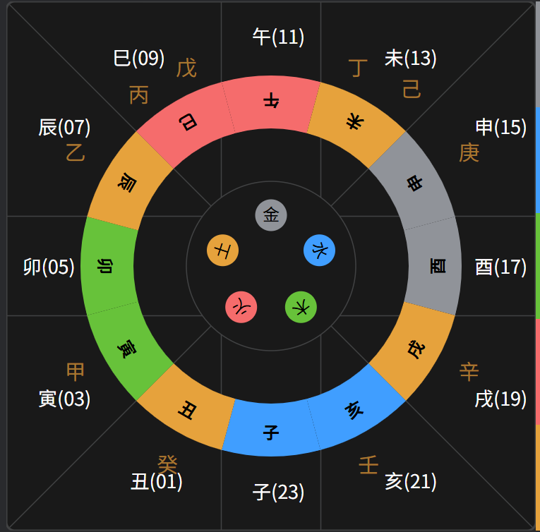

# 四课三传

四课是排盘的结果，三传是对四课关系的研究。

四课三传，分化出具体的课体课格，再结合天将、神煞、旺相休囚等，才能进行解读。

## 一、准备

### 1、占时

占时用来确定地盘的状态。

占时可以取当前的时间，也可以用任意一个数字对 12 取余。然后把占时，转为十二地支中的某个符号，以此作为地盘的定位。

### 2、月将

月将，用来确定天盘的状态。

月将原本的取法，是取月建所合，但是在后来的实践中，逐渐变为取日之所躔，再到后来的中气换将。

我们在实践中，取中气换将为月将。

### 3、起神将

地盘和天盘，代表了对客观环境的认识；将盘则是代表了对社会活动的认识。

将盘是依附于天盘的。在起十二天将时，如果占时在日出之后，日落之前(这里按照地盘上方位的理解，规定卯时日出，酉时日落)，
则贵人为昼贵，否则为夜贵，然后按照对应的规律，找到贵人定位于天盘的地支符号：

```js
甲戌庚牛羊，
乙己鼠猴乡。
丙丁猪鸡位，
壬癸蛇兔藏。
六辛在马虎，
此是贵人方
```

| 占日天干 | 昼贵对应的天盘符号 | 夜贵对应的天盘符号 |
| -------: | :----------------: | :----------------: |
|   甲戌庚 |         丑         |         未         |
|     乙己 |         子         |         申         |
|     丙丁 |         亥         |         酉         |
|     壬癸 |         巳         |         卯         |
|   六辛日 |         午         |         寅         |

找到贵人所在天盘的位置，再查看所对应的地盘位置，
如果地盘位于天门之后(亥为天门，亥到辰为天门之后)，则象征阳长阴消，天将顺序排列，贵人顺时针排列；
如果地盘位于地户之后(巳为地户，巳到戌为地户之后)，则象征阴长阳消，天将逆治来抑阴除乱，贵人逆向排列。


### 4、排盘

占时用来选取出地盘的地支，月将选出来天盘的地支，然后把两个盘子重叠在一起，并且将两个选出来的地支对齐，就形成了盘面。


## 二、四课

占日的干支，干叫日，支叫辰。日上神，叫干阳神，再分化出来干阴神；辰上神，叫支阳神，再分化出支阴神。
在体用说法中，日为体，辰为用。

四课第一课为干阳神，第二课为干阴神，第三课为支阳神，第四课为支阴神。
四课分别对应阴阳学说的四象，第一课对应老阳，第二课对应少阳，第三课对应老阴，第四课对应少阴。
第一课象征显性的主动行为，第二课象征潜在的动力，第三课环境显性的影响，第四课象征环境背后的因素。

日为体，所以天将、六亲、旬空、旺相休囚，都作用再日干上。所以占卜不同的事儿，干和支分别表达不同的东西：

- 天时：干为天为阳为白天，支为地为阴为黑天。干为占的天时，支为占的地方。
- 地理：干为高岗、陆地，支为平原、水路。
- 人物：干为君，尊，官，父，男，客，支为臣，卑，民，子，女，主人
- 其他：干为人口，支为房宅；干为行人，支为交通工具；干为卖主，支为买主，货物；干为考生，支为考场；
- 其他：干为逃犯，支为场所；干为原告，支为被告；干为失主，为失物，盗贼；干为病人，支为寝室；

干和干阳神，支和支阳神，分别反应日干和日支的情况。

干和支，干阳神和支阳神，分别体现主客内在关系，和外在关系。

再利用干阳神和支，支阳神和干，来体现双方交往情况。

这三种关系，结合六亲、生化克制、十二长生，进行评估衡量。

## 三、三传

分析四课的关系，利用[`九宗门`](./九宗门.md)作为规则，将会得出三传，三传用于描述四课所揭示的事情于后的变化发展。

::: tip
:bulb: 四课，揭示所占卜的事情的静态信息，说明主客关系、显隐因素，用来判断主客盛衰凶吉的情况。

:unlock: 三传，用于描述主客相应的动态变化。
:::

初传，由四课求出，代表事情的本质、关键节点和初始征兆。所以初传被称为`"发端门"`.

> 事体，事件的本体；事机，事件的关键点，转折点；始应，事件的征兆或触发条件。

初传遁得中传，中传用来否定初传，用来体现事情的逐渐变化，中传也叫`"移易门"`。

由中传遁得末传，来体现事物的最终趋势走向，所以末传叫`"归计门"`。

三传可以和日干进行比较，得出生克制化的结果，从而得出三传的凶吉。
具体的情况，可能需要更细致的区分三传是对日干凶吉，还是对日支凶吉，可以来说明更细颗粒度的情况。

## 四、四课三传的关系

四课是三传之本，三传为四课变化的后续。

四课和三传凶吉不一致时的判断原则：

`干支吉兮三传凶，某事不成终不善。三传吉兮干支凶，事吉而成无少惮。`

事体可由四课决定的，三传就只起到辅助作用；三传能决定的，四课就是辅助条件。一般情况下个人之事以三传为主，涉及主客关系的以四课为主。

对于课传关系，在毕法赋中有详细介绍。
